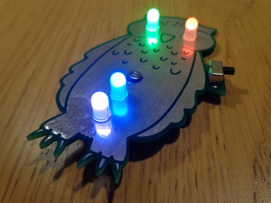

.. Project OTIS documentation master file, created by
   sphinx-quickstart on Thu Jun 25 19:04:09 2020.
   You can adapt this file completely to your liking, but it should at least
   contain the root `toctree` directive.

Home
====

Welcome to the website for Project OTIS, the Leeds Raspberry Jam's (twitter_) owl badge.
--------------------------------------------------------------------------------------

OTIS (out there initiating STEM) is designed to be an easy to assemble and customisable beginner's soldering kit, featuring a metallic owl design on the front, 4 RGB LEDS (can be set to one of seven colours individually) and is powered by a CR2032 battery.

- `Begin the assembly guide (OTIS)`_
- `Begin the assembly guide (OTISjr.)`_
- `View this project on GitHub`_
- `View the feedback form`_

.. raw:: html

   

.. youtube:: 8DNA1CCd7PA
   :width: 100%

|

.. toctree::
   :titlesonly:
   :caption: Contents:

   Assembly Guide (OTIS) <ag>
   Assembly Guide (OTISjr.) <ag-jr>
   Schematics & Board Diagrams <files>
   Credits & Licensing Information <licensing>
   Soldering Tutorial <s_tutorial>
   
.. _twitter: https://twitter.com/leedsraspjam
.. _`Begin the assembly guide (OTIS)`: ag.html
.. _`Begin the assembly guide (OTISjr.)`: ag-jr.html
.. _`View this project on GitHub`: https://github.com/leedsraspjam/OTIS
.. _`View the feedback form`: https://otis.leedsraspjam.co.uk/feedback
