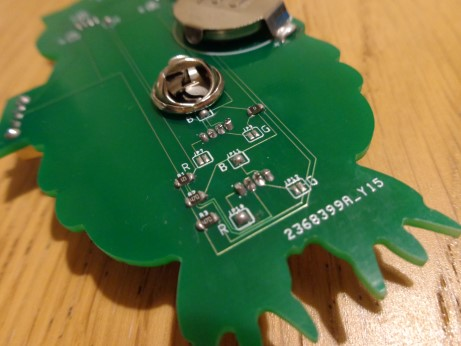

Step 5 - Testing
=================

Flick the switch and verify the LEDs light as intended.

.. youtube:: 8DNA1CCd7PA
   :width: 100%

|

Troubleshooting
***************

- Make sure all parts have no holes or black spots in the solder joints (if necessary flow more solder in).
- Try applying pressure to the battery holder, if the LEDs light there is a poor connection between the battery and the board, make sure the pins of the battery holder are flush with the board and the two clips on the top of the holder are touching the battery. Adding more solder to the negative pad may also fix this problem.
- There are some images of what a fully assembled kit should look like below.
- If you still can't get it working - get in touch either on Tindie or by emailing `hello@leedsraspjam.co.uk`_

.. image:: images/s12-1.jpg
.. image:: images/s12-2.jpg
.. image:: images/s12-3.jpg

`Return to the Homepage`_

.. _`Return to the Homepage`: index.html
.. _`hello@leedsraspjam.co.uk`: mailto:hello@leedsraspjam.co.uk